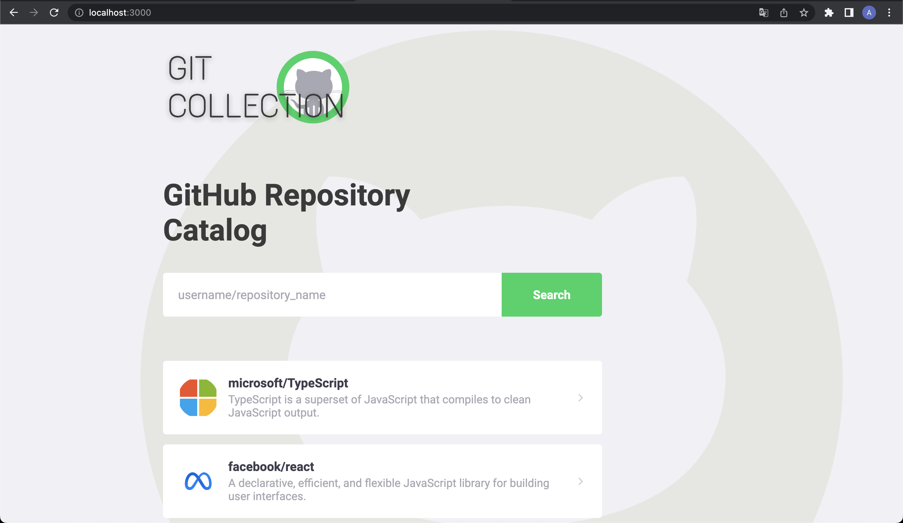
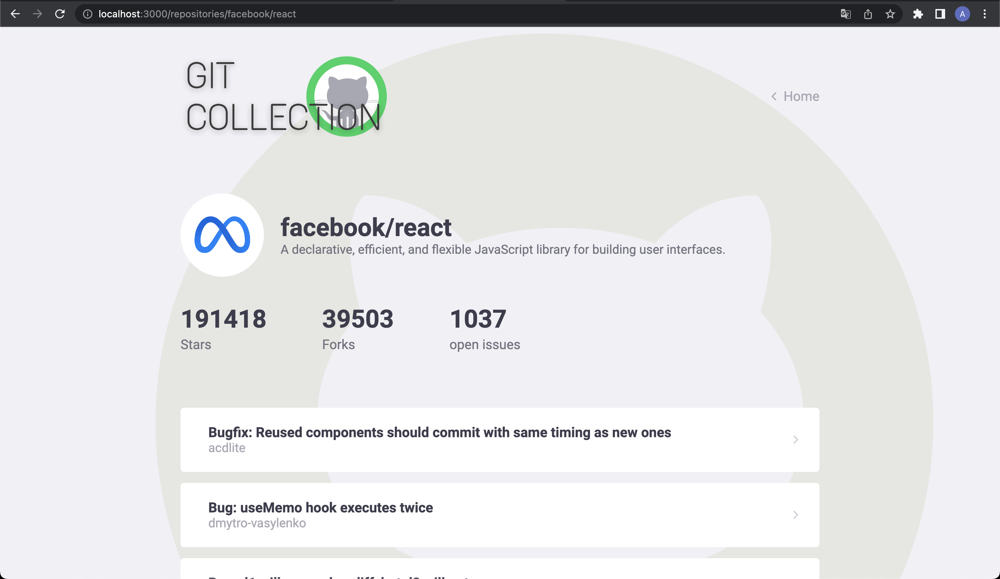

# Git Collection

Basic React application that uses Create-React-App and the Styled Components library.
It consumes the public github api to create a catalog with your favorite repositories.

https://collectiongithub.netlify.app/




## 🚀 Starting

These instructions will allow you to make a working copy of the project on your local machine for development and testing purposes.

### 📋 Prerequisites

What things do you need to install the software?

```
node.js ^12
```

### 🔧 Installation

Make a clone of this repository and install it in your development environment using the following command in your terminal (choose an appropriate directory):

```
git clone https://github.com/decarolis/gitcollection.git
```

After cloning the repository content, access the created directory and install the dependencies:

```
cd gitcollection

npm install
```

After this installation, run the application with the npm start command. The application will be available at http://localhost:3000.

## 🛠️ built with

* [React.17]
* [TypeScript]
* [Axios]
* [StyledComponents]
* [React-Router-Dom.5]

## 📄 License

This project is under the MIT License


---
⌨️ with ❤️ by [André De Carolis](https://github.com/decarolis) 😊
